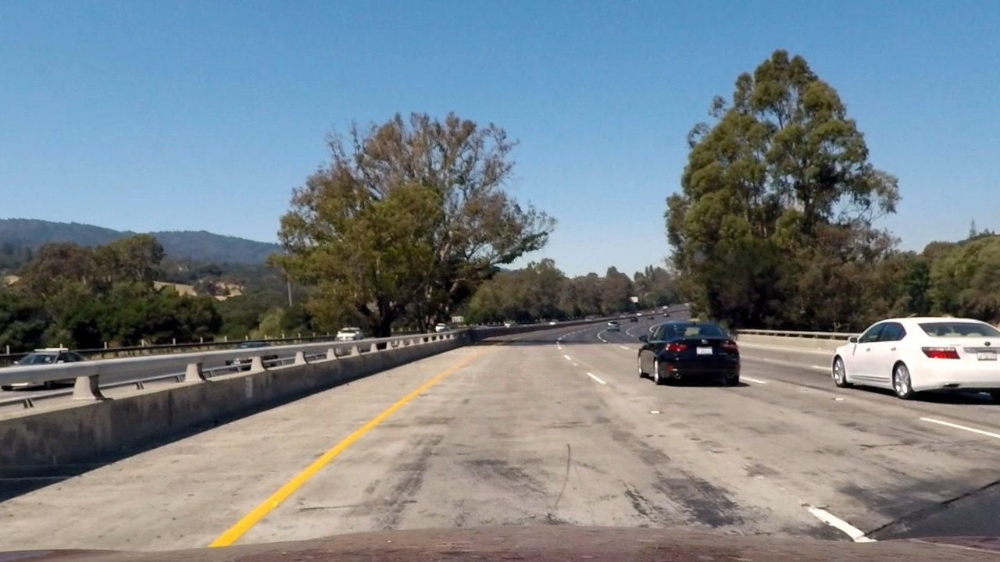
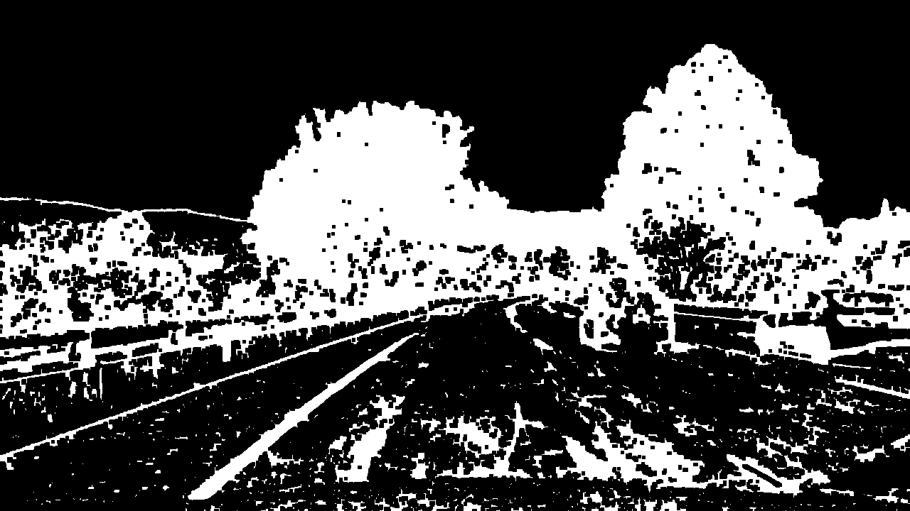
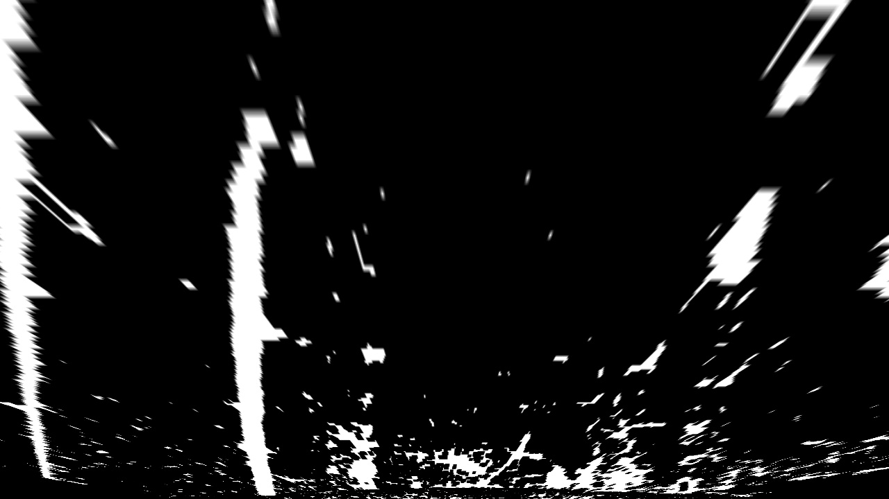
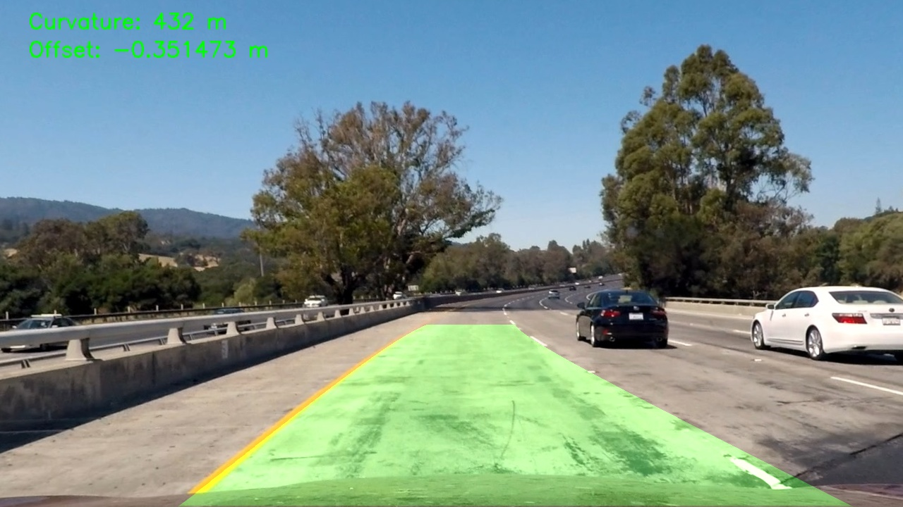

**Lane Finding Project**

The goals / steps of this project are the following:

* Compute the camera calibration matrix and distortion coefficients given a set of chessboard images.
* Apply a distortion correction to raw images.
* Use color transforms, gradients, etc., to create a thresholded binary image.
* Apply a perspective transform to rectify binary image ("birds-eye view").
* Detect lane pixels and fit to find the lane boundary.
* Determine the curvature of the lane and vehicle position with respect to center.
* Warp the detected lane boundaries back onto the original image.
* Output visual display of the lane boundaries and numerical estimation of lane curvature and vehicle position.

### Writeup / README

### Camera Calibration

#### 1. Briefly state how you computed the camera matrix and distortion coefficients. Provide an example of a distortion corrected calibration image.

Camera calibration was performed using multiple images of a chessboard pattern. 
For each calibration image, chessboard corner points were detected and associated with their corresponding 3D object points, assuming the chessboard lies on a flat planar surface.
Using these 2D–3D point correspondences, the camera matrix and lens distortion coefficients were computed using OpenCV calibration routines. 
The resulting parameters were saved to a YAML file and reused to undistort all subsequent images and video frames.

A distortion-corrected calibration image was generated to verify that straight lines in the scene remain straight after correction.

### Pipeline (single images)

Each input image is first undistorted using the previously computed camera matrix and distortion coeffficients. 
This step removes lens distortion and ensures that straight lane markings appear straight in the image.

An example of a distortion-corrected image is shown below.

To create a thresholded binary image highlighting lane markings, a combination of color-based and gradient-based methods is used.
This step is implemented in the function `createBinaryImage()` located in the module `src/pipeline.cpp`. This function takes the undistorted input image and applies multiple thresholding operations to extract lane-relevant pixels.
Within `createBinaryImage()`, the image is converted into different color spaces to emphasize white and yellow lane markings under varying illumination conditions. In parallel, Sobel gradients are computed in the x-direction to detect strong vertical edges corresponding to lane boundaries. The resulting color masks and gradient masks are then combined into a single binary image.

An example of the resulting binary image is shown below.

A perspective (bird’s-eye view) transform is applied to the thresholded binary image to simplify lane detection.
This step is implemented in the function `warpPerspectiveBinary()` located in the module `src/pipeline.cpp`. 
The source points define a trapezoidal region around the lane in the original camera view, while the destination points map this region to a rectangular area in the warped image. This transformation makes the left and right lane lines appear approximately vertical and parallel, which greatly simplifies lane pixel detection and polynomial fitting. The inverse perspective matrix is also computed in the same module and later used to project the detected lane area back onto the original image.

An example of the perspective-transformed (warped) binary image is shown below.

Lane-line pixels are identified in the warped binary image using a histogram + sliding-window search, and the lane boundaries are then fit with a 2nd-order polynomial.

Lane pixel detection and polynomial fitting are implemented in the function `detectLane()` in the module `src/lane_detect.cpp`. This function:
- computes an x-axis histogram over the bottom half of the warped binary image to find the initial left and right lane base positions,
- collects all non-zero pixels using `cv::findNonZero`,
- runs a vertical sliding-window scan (with parameters `nwindows`, `margin`, `minpix`) to accumulate left/right lane pixel coordinates and recenters each window based on the mean x-position of pixels found in the window,
- fits a 2nd-order polynomial `x = A*y^2 + B*y + C` for the left and right lanes using the helper function `polyfit_x_of_y()` (also in `src/lane_detect.cpp`),
- applies a simple sanity check (right lane must be sufficently to the right of left lane near the bottom of the image) and stores the result into a `LaneFit` structure.

The lane detection stage is called from the main frame-processing function `processFrame()` in `src/pipeline.cpp`, which passes the warped binary image into `detectLane()` and then uses the fitted polynomials for lane visualization and further metrics.

The radius of curvature of the lane and the vehicle position with respect to the lane center are computed after fitting second-order polynomials to the detected left and right lane lines.

Curvature is computed in `computeCurvature()` in `src/lane_detect.cpp`. This function takes the fitted polynomial coefficients of a lane line and evaluates the standard curvature formula for a 2nd-order polynomial at a chosen y-position. In addition, the helper `curvatureMeters()` in `src/pipeline.cpp` performs the pixel-to-meter conversion (using meters-per-pixel scaling) and outputs the curvature value in real-world units (meters).

Vehicle offset from lane center is computed in `computeVehicleOffset()` in `src/lane_detect.cpp`. This function evaluates the left and right lane polynomials near the bottom of the image, computes the lane center as the midpoint between the two lane x-positions, compares it to the image center (assumed vehicle position), and converts the pixel difference into meters to obtain the vehicle’s offset from the lane center.

An example image of the final result is shown below, where the detected lane boundaries are projected back onto the original road image and the lane area is highlighted clearly.

### Pipeline (video)

The final video output produced by the pipeline can be found at the following location:

### Discussion

The main challenges encountered during implementation were varying lighting conditions, shadows, and partially worn or occluded lane markings. These factors can reduce the effectiveness of fixed color and gradient thresholds and lead to noisy or incomplete binary images.

The pipeline is most likely to fail in situations with strong shadows, abrupt illumination changes, heavy occlusions by other vehicles, or non-standard lane markings. In such cases, the sliding-window search and polynomial fitting may produce unstable or incorrect lane estimates.

To improve robustness, adaptive or illumination-aware thresholding techniques could be used.
More advanced approaches, such as learning-based lane detection methods, could further improve performance in challenging road and lighting conditions.

### Other results

All input images and videos are tested as well, final results are available at the following link:
https://drive.google.com/file/d/19Dg-dA0cYWxRH6yDHZzJ2oJLJajfDf5L/view?usp=drive_link
